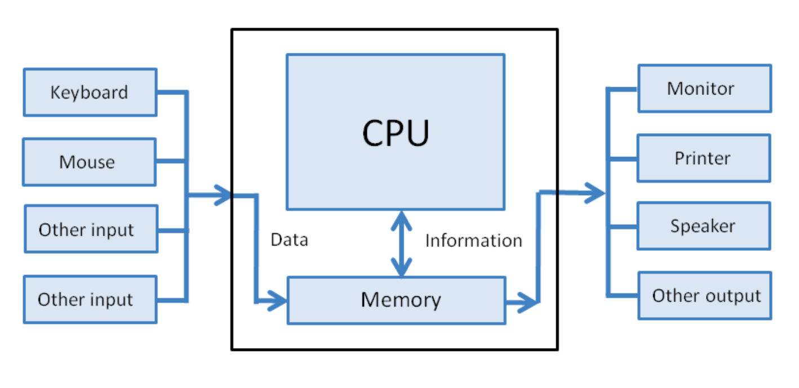
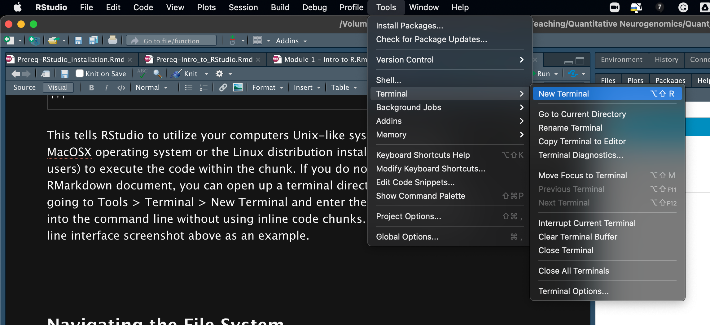
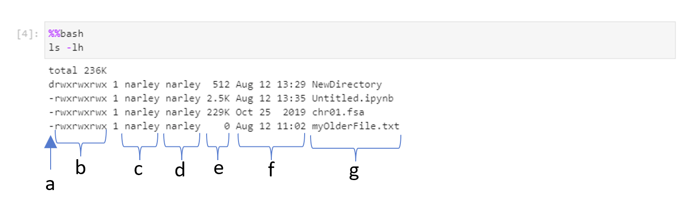

```{r setup, include=FALSE}
knitr::opts_chunk$set(echo = TRUE)
```

# Introduction

# Learning Objectives

# Basics

## Hardware, software, and the operating system

-   harware = laptop, desktop, iphone and the physical components of your computer
-   software = word processing, spreadsheet, graphics, games, email
-   OS (also software) = Windows, Mac, Android, Ubuntu, Debian, Unix, Linux

## Computer Structure



## Interfaces

How we interact with the computer (input and output)

### Graphical User Interface (GUI)

Anything you see and and click (FileExplorer, Finder) \### Command Line Interface (CLI) In the remainder of this document we are demonstrating how to run shell (bash) commands within an RMarkdown document/notebook by indicating which language we'll be using at the beginning of each code chunk.

    '''{bash}

    '''

This tells RStudio to utilize your computers Unix-like system (either the MacOSX operating system or the Linux distribution installed by Windows users) to execute the code within the chunk. If you do not wish to use a RMarkdown document, you can open up a terminal directly in RStudio by going to Tools \> Terminal \> New Terminal and enter the commands directly into the command line without using inline code chunks.



See the command line interface screenshot below as an example.


## Navigating the File System

The first thing we need to figure our is 'where are we' in the file system. To do this, we want to '**P**rint the **W**orking **D**irectory' using the shell command `pwd`

```{bash}
pwd
```

We can list the contents of the directory using the bash comand `ls`

```{bash}
ls
```

### Options/Input arguments

Bash/shell commands can take input arguments or options. One convention is to use a dash ( - ) to specify arguments. For example, we can ask ls to show a more detailed list of information for each file/folder:

```{bash}
ls -l
```

We can aggregate different options by directly appending options one after another. The following shows how to display file sizes in human readable formats ( -h ):

```{bash}
ls -lh
```

Sometimes commands take in arguments for various purposes. Again, using ls as example, it can take path as an argument. Without the path, it will by default show the current listings, as shown above. Given a path, it will list items in that path. The following command lists all the files and directories in the directory directly above your current directory:

```{bash}
ls ../
```

### Manual Pages (man)

It is certainly not expected that you memorize all arguments for every command. This is where the manual ( man ) comes in handy. You can use man command_name to find information about how to use a specific command. For example:

```{bash}
man ls
```

Here, man is a command that takes one input argument (which should be a Bash command) and outputs the corresponding manual.

### Creating and Navigating Folders

Now that we have a basic overview of how to interact with the computer in bash, it will be useful to understand how to create folders (directories) and navigate around our system. We've already used the pwd command to learn where we currently are. But what if we wanted to make a new directory to contain a project? The mkdir command stands for "make directory". It takes in a directory name as an argument, and then creates a new directory in the current working directory.

```{bash}
mkdir myDirectory
```

Nothing seemed to happen? Lets check and see if our new directory was made:

```{bash}
ls -l
```

There it is, lets try and move into the directory. cd stands for "change directory". Just as you would click on a folder in Windows Explorer or Finder on a Mac, cd switches you into the directory you specify. In other words, cd changes the working directory.

```{bash}
cd myDirectory
pwd
```

Note that within the above chunk, you actually ran two commands in bash, one right after the other. You first changed your location within the file system by using the `cd` command. Then you used the `pwd` command to list out your current location in the file system. All scripting will follow this type of linear instruction list unless we create a loop (more on that later!). Now we have moved into the folder/directory we just made. We can move back into the previous directory by using the shortcut `..`

```{bash}
cd ..
pwd
```

And finally, we can remove an (empty) directory using rmdir .

```{bash}
rmdir myDirectory
ls
```

### Review

-   The command line is a text interface for the computer's operating system. To access the command line, we use the terminal.
-   A filesystem organizes a computer's files and directories into a tree. It starts with the root directory. Each parent directory can contain more child directories and files.
-   From the command line, you can navigate through files and folders on your computer
    -   `pwd` outputs the name of the current working directory.
    -   `ls` lists all files and directories in the working directory.
    -   `cd` switches you into the directory you specify.
    -   `mkdir` creates a new directory in the working directory.
    -   `rmdir` removes an empty directory

## Viewing and changing files

### Creating files

There are several ways to create a file. One of the easiest is to just create an empty file by touching it ( `touch` )

```{bash}
touch myBrandNewFile.txt
```

```{bash}
ls -l
```

### Side note about wildcards

-   The `*` matches one or more occurrence of any character
-   The `?` matches a single occurrence of any character
-   Another shortcut is tab completion, type the beginning of a file or directory, then hit tab for it to automatically fill in the rest (this will likely only work in the *actual* terminal, not from within a notebook)

You just looked at the files that are in your current directory when you used ls -l and you should see your new file `myBrandNewFile.txt`. Let's test out using the wildcard and tab complete options.

```{bash}
ls *.txt
```

OR

```{bash}
ls my?randNewFile.txt

```

### Writing to a file in bash

Side note over. Let's get back to writing files!

We created the file and gave it a name, but it is completely empty at this point. We can write directly to a file by redirecting some content into the file. This is achieved with the `>` (redirect). Imagine that this is an arrow pointing to where you want to put the output. Here we will also introduce you to the `echo` command which simply repeats the first argument (in this case the argument is the text 'Hello World'). Here we're going to have the output of echo redirected into our new file.

```{bash}

echo 'Hello World!' >myBrandNewFile.txt
```

We can now view the contents of a file by using the command cat which returns the entire contents of the file.

```{bash}
cat myBrandNewFile.txt

```

### Moving and removing files

The 'mv' command has a couple of different uses. You can use it to move files from one directory to another (imagine moving a file from your 'Downloads' to your 'Desktop'). The `mv` command could also be used to rename files or directories. Let's first explore renaming our file using the `mv` command below which take the file to be moved as the primary argument and new name of the file as the secondary argument:

```{bash}
mv myBrandNewFile.txt myOlderFile.txt
ls -l
```

We now have renamed our file to 'myOlderFile.txt'

```{bash}
mkdir TemporaryDirectory
mv myOlderFile.txt TemporaryDirectory
cd TemporaryDirectory
pwd
ls
```

In the above chunk we 1) made a new directory 2) moved our file into that directory 3) changed our location within the file system to our new directory 4) printed out our location 5) listed our current directory contents

And finally, we can remove a file using the `rm` command. The `rm` command removes files or directories [(removed files will be gone forever, proceed with caution)]{style="color: red;"}:

```{bash}
rm myOlderFile.txt
ls -la
```

Remember you can navigate to your previous location by using the command `cd ..` and remove the new directory by using the command `rmdir`

#### Key Concept

You may have already noticed that in our file and directory names we do not use spaces. This is because bash commands often use spaces as a way to separate arguments. Spaces in the titles of your files or directories are interpreted by bash commands as additional arguments. Best practice is to use naming conventions like 'CamelCase' (where the first letter of a new word is capitalized) or use an underscore to separate words. Examples: MyNewFile.txt or my_new_file.txt

## File Properties

We have now created, deleted, moved, and manipulated files, but what if we simply want to know more about their contects without actually changing them? For example, we can download a chromosome file from a database and learn more about its contents.

### Downloading files from the internet

We can use the wget command followed by the URL. The file will be downloaded into your current directory location. This may take a minute to download

```{bash}
rm chr01*  # Delete existing files before run.
wget http://sgd-archive.yeastgenome.org/sequence/S288C_reference/chromosomes/fasta/chr01.fsa
```

### File sizes

The command `du`, which stands for 'disk usage' provides you with information about your file and directory sizes. If we pass our newly downloaded file 'chr01.fsa' to the command `du` as an argument, it will tell us size of our file.

```{bash}
du chr01.fsa

du -h chr01.fsa #outputs in 'human-readable' format (byte, kb, mb, etc)
```

### File compression/uncompression

This is done using programs such as gzip/gunzip. File compression may be key when dealing with large file sizes such as sequencing data. Let's test it out!

```{bash}
gzip chr01.fsa # gzip command to compress the file, notice the new file extension of *.gz
du -h chr01.fsa.gz
gunzip chr01.fsa.gz # gunzip command to uncompress the file, removes the file extension
du -h chr01.fsa
```

In this example we are using gzip directly on the chr01.fsa file. If we wanted to zip the file, but keep the original unzipped file as well, we could use the -k argument.

```{bash}
gzip -k chr01.fsa
```

To count the number of words, lines, and characters in your file you can use the command `wc`

```{bash}
wc -w chr01.fsa #words
wc -l chr01.fsa #lines
wc -m chr01.fsa #characters
```

### Ownership and Permissions

We have used `ls -lh` previously to look at the file in our directory, but now that we know a little bit more about the files and how to manipulate them, we should understand a little bit more about file ownership and permissions.



-   the first line corresponds to the total size of all the files contained within the target directory
-   the remaining lines are each of the files or directories contained within that directory
-   for each line the information is as follows:
    -   a) the first character 'd' or '-' tells you if the item is a directory or file, repectively
    -   b) characters 2-10 designate the permissions of the file owner (characters 2-4), group owner (characters 5-7), and all other users (characters 8-10)
        -   'r' for read which allows the contents of the file or directory to be read or listed
        -   'w' for write which allows the file or directory to be created, deleted, or edited
        -   'x' for execute which allows the file to perform commands or searching through a directory
    -   c) identity of the current file owner
    -   d) identity of the current file group
    -   e) size of file or byte block size of the directory
    -   f) date and time the file or directory was last modified
    -   g) file or directory name

Many times users will run into error messages because they do not have appropriate permissions to read, write, or execute a file or directory. Keep this in mind for the future if you run into errors! You can `ls -lh` in your current directory to check out your own permissions.

## Viewing Files
We previously used the command `cat` too look at the contents of small files. However, for large files (like our chromosome file with over 3000 lines, commands like `cat` are not particularly useful if we perhaps only need a small subset of that information. A few other commands we can use to view file content are `head` and `tail` which display the first 10 lines and the last 10 lines of the file, respectively. If you wish to view more, you can use the argument `-n`, for example, `head -n 20 <your_file_name>` would display the first 20 lines of your file.

```{bash}
head chr01.fsa
```

```{bash}
tail -n 20 chr01.fsa
```

You can view the full contents of your file by using either the `less` or `more` commands. These will function differently whether you are using them inside an Rmd notebook/markdown, or directly in the terminal. In an Rmd, the entire contents of the file will be reported in the results chunk. In the terminal, `more` or `less` will return a page at a time so you can 'scroll' through the document.

```{bash, exec=FALSE}
more chr01.fsa
```

Try and switch to the terminal and try `less` or `more` to view the `chr01.fsa` file. You can:
  * use up and down arrows to scroll
  * spacebar scrolls down 1 page at a time
  * hit q to quit

##Searching in files

Rather than scanning through the entire contents lines of a file by eye, you can also use the `grep` command to pull out specific words or lines in the case of this chromosome file. Using the `-c` argument tells `grep` to return the number of times the pattern occurred.

```{bash}
grep "TACCCTACC" chr01.fsa
grep -c "TACCCTACC" chr01.fsa

```

`grep` can also utilize wildcards in the search pattern. The `.`wildcard is used for searching for a single character substitution in the given pattern. The `*` wildcard is used for searching for any number of character substitutions within the given pattern.

```{bash}
grep "TACC.TACC" chr01.fsa
grep -c "TACC.TACC" chr01.fsa
```
```{bash}
grep "TACC*TACC" chr01.fsa
grep -c "TACC*TACC" chr01.fsa
```

## Piping/redirection
Most of the commands that we have used thusfar have utilized a single command that returned its output to the command line. Perhaps you want to save the ouput of your command to a new file, which can be done using the redirect `>` symbol. Here we are taking the last 10 lines from the `chr01.fsa` file and writing them to a new file which we are calling `tail.txt`

```{bash}
tail -n 10 chr01.fsa > tail.txt
```

If you want to use more than one command on a piece of data and don't necessarily want to write the output to a new file every single time, we can pipe the commands together using the `|` symbol (vertial bar; usually right above the return key). In this example we are printing out the contents of our `chr01.fsa` file using the `cat` command, passing that output to the `head` command which will only take the first 10 lines, and finally passing that output (those first 10 lines only) to the `tail` command which will take the last 5 lines of that input. Essentially what we have now done is pulled out lines 5 through 10 of our `chr01.fsa` file.

```{bash}
cat chr01.fsa | head -n 10 | tail -n 5
```
## You made it through this intro! Great job!
Let the instructors and/or TAs know if you have any questions and we will expand upon these lessons as needed in class. We will use the command line often throughout this course, and you will have many more opportunities to familiarize yourself with this interface, and how we use the command line to run individual tools/components of many bioinformatics & computational biology pipelines and to string together inputs and outputs of different programs.

# Session Information

```{r}
sessionInfo()
```
