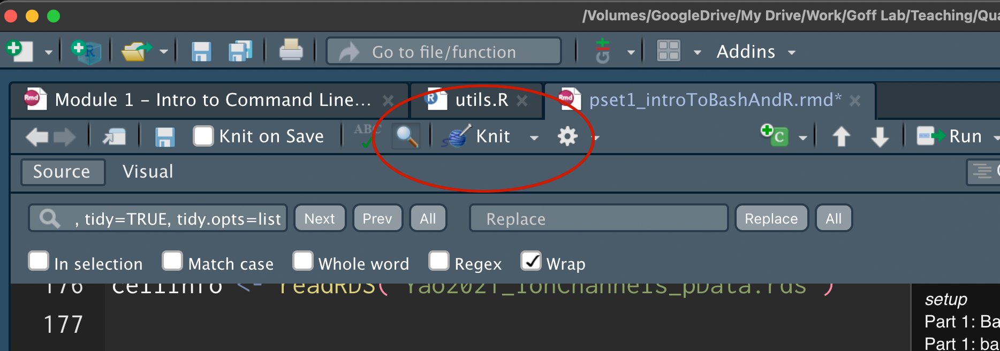
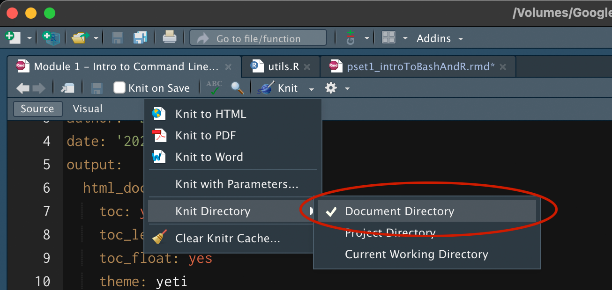

```{r setup, include=FALSE}
knitr::opts_chunk$set(echo = TRUE)
```

## Part 1: Basic bash scripting

First, make sure that you have the `ion_channel_sequences` folder in your working directory. If you unzipped `Module_1_pset.tar.gz` in your working directory of choice, the folder should already be in the correct location.

Then, answer each question using Bash scripting. Please note that the bash operations should be executed inside a `bash` code chunk like so:

```{bash}

```

You'll need to have your folder of sequence files (`ion_channel_sequences`) in your working directory. Print your working directory and its contents.

```{bash}

```

We'll start with Kcna1.fa, a FASTA file that contains the genome sequence of a mouse voltage-gated potassium channel. The first line contains a carat ("\>"), followed by a unique sequence identifier. The actual sequence starts on the next line. See for yourself by printing the first three lines of the file. Note that FASTA files can contain multiple sequences, but this one has just one.

```{bash}

```

Print just the sequence into a new file called Kcna1_sequence.txt

```{bash}

```

How many lines are in Kcna1_sequence.txt? How many characters are in the file? If you subtract the number of lines from the number of characters, you should get the number of nucleotides in the Kcna1 gene. Why? Answer in a comment.

```{bash}
 
```

Count the number of times each nucleotide appears in the Kcna1 gene.

```{bash}

```

Many voltage-gated potassium channels have a signature selectivity filter motif with the amino acid sequence `TVGYG`. The reverse translation of this AA sequence can be modeled using the following DNA codons:

`AC[TCAG] GT[TCAG] GG[TCAG] TA[TC] GG[TCAG]`

Note the bases in square brackets. This string uses [regular expressions](https://quickref.me/regex) to allow flexibility in the wobble base of each codon. For example the first codon in this motif evaluates to `AC[TCAG]` which, when used with a grep search, will find matches that begin with `AC` followed by _any_ base in the range `[TCAG]`. Use this provided motif sequence as an argument to `grep` to search the Kcna1 gene for any instances that match.

Confirm that the Kcna1 gene has a sequence that would encode these amino acids. _Hint: Your first step should be to remove newline characters from Kcna1_sequence.txt._

```{bash}

```

Write a bash script that takes a FASTA file (with a single sequence) and a target sequence motif as input and outputs the number of times that the motif appears in the FASTA file.

Your script must (in order):
  1. Take a fasta file as the first argument
  2. Take a string (motif) as the second argument
  3. Remove the header row from the fasta sequence (ie. select just the sequence of the gene)
  4. Trim the lines to remove newline characters ("\n")
  5. Search the trimmed gene sequence for the provided motif and count the number of occurances.
  6. Return the number of motifs found.
  
After writing your script, check its file permissions and make it is executable.

```{bash}

```
Use your new script here to determine which of the FASTA files in the ion_channel_sequences folder are likely to encode a voltage-gated potassium channel.
Construct a loop to check whether each of the FASTA files in the ion_channel_sequences folder contains the `TVGYG` motif. Print the names of just the files that do contain the motif.

```{bash}

```

## Part 2: basic R

Get your dependencies. For this section, you will need the ggplot2 package. If you haven't already, you can get it by installing the whole tidyverse as suggested here: <https://ggplot2.tidyverse.org/>. You should also read the file `utils.R`, which loads your dependencies and contains some supplementary functions. You will want to look at utils.R yourself for guidance on using these functions. Lastly, make sure you have `Yao2021_ionChannels_expMat_genesByCells.rds` and `Yao2021_ionChannels_pData.rds` in your working directory.

```{r}

```

Now load `Yao2021_ionChannels_expMat_genesByCells.rds`, a genes x cells matrix that contains publicly available gene expression data from single-cell RNA-sequencing performed in motor cortex (Yao et al. 2021, <https://doi.org/10.1038/s41586-021-03500-8>). Specifically, this matrix includes the expression of the ion channels that you looked at in Part 1 of this problem set.

```{r}
# load the expression data here and save it as a variable

```

Let's take a look at the first few values to familiarize ourselves with how these data are arranged. Slice this matrix so that only the first 5 rows and first 5 columns are displayed.

```{r}

```

The value in each entry of `expMat` corresponds to the count of mRNA transcripts for a specific gene detected within a single cell. Therefore, each row contains the expression estimates for a particular gene across all assayed cells, and each column contains the expression values across all genes for a particular cell. How many genes are included in this matrix? How many cells?

```{r}

```

The row names of the matrix are the short names of the genes. The column names are IDs for each cell. Confirm that this is the case by printing just the first 5 row names and the first 5 column names.

```{r}

```

What is the most common gene expression value in the matrix? Hint: The built-in R function "mode" will not help you here (feel free to see what it does though!). There's a function in utils.R that you will find useful. Is the answer what you expected?

```{r}

```

That most common value makes up what percentage of all the expression values in the matrix?

```{r}

```

To analyze this data, it is important to know whether or not it is normally distributed. Plot a histogram of all the expression values in the matrix. Ensure that the axis labels make sense. What does this histogram tell us about the single-cell RNA-seq count data?

```{r}

```

Hopefully by now, you've deduced that RNA-seq count data is not normally distributed. It can sometimes be helpful to log transform the data, so that it becomes closer to a normal distribution. Log transform the data using base 2 and a pseudocount of 1. Save the result as a new variable and plot a histogram. Again, check that your axis labels make sense.

```{r}

```

Now, we can look at what types of cells express of these ion channel genes. Load `Yao2021_ionChannels_pData.rds`, which contains a data.frame with information about each of the cells in the counts matrix. Print the names of the columns included in this data.frame.

```{r}

```

What are the possible values in the column "cellClass"? What are the possible values in the column "cellSubclass"?

```{r}

```

The values in the column "cellID" correspond to the column names of the counts matrix. Merge this dataframe with the transpose of the log-transformed counts matrix to create a new dataframe that includes gene expression information for each cell. This new dataframe should have a new column for each gene.

```{r}

```

Now use the function `makeBP` included in Utils.R to create box plots of gene expression by cell class for your gene of choice. Your new dataframe will be the first argument and your gene of choice will be the second argument.

```{r}

```

One of the ion channels is expressed more highly in glia than in neurons. To find it, use a loop to create box plots for each gene. Note: In this case, it is particularly obvious, but eventually we will want to quantify observations like this.

```{r}

```

## PSet Submission

When you have completed the above exercises, please make sure that you have added your name and date into the yaml header at the top and "knit" this document.



When you are "knitting" please make sure that you set the knit directory to: "Document Directory" to that RStudio knows where to find all of the accessory files associated with this problemset.



Once this completes without error, please upload the compiled .html or .pdf document to the "Problem Set 1" assignment on Canvas.

## Session Information
```{r}
sessionInfo()
```
