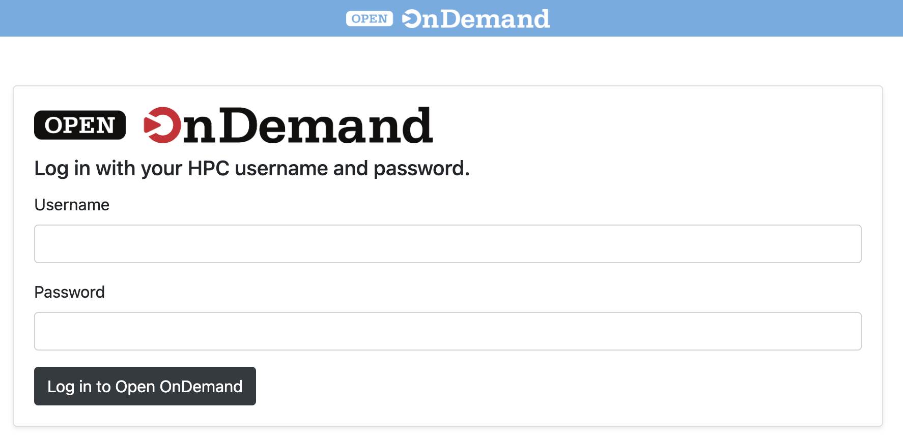
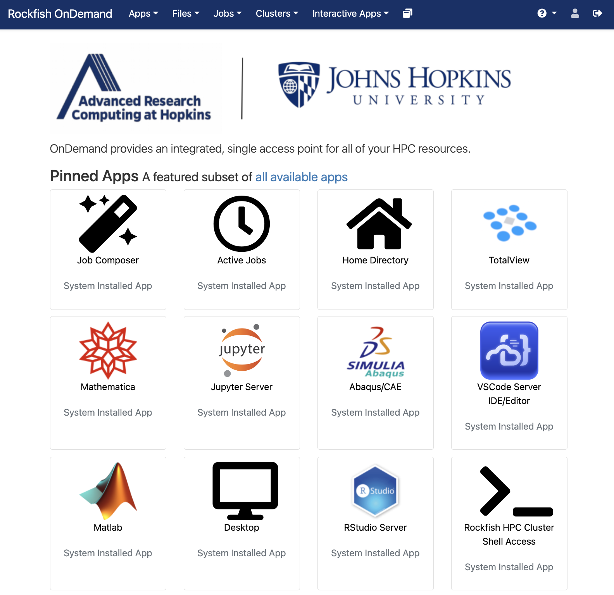
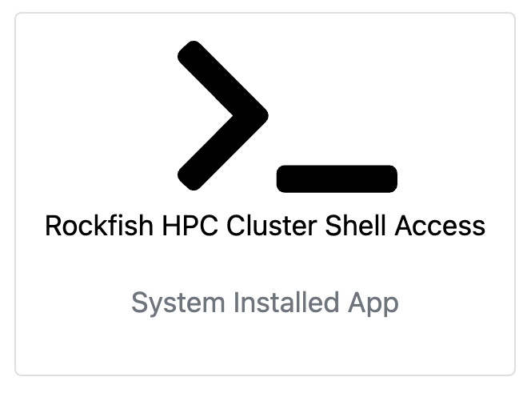
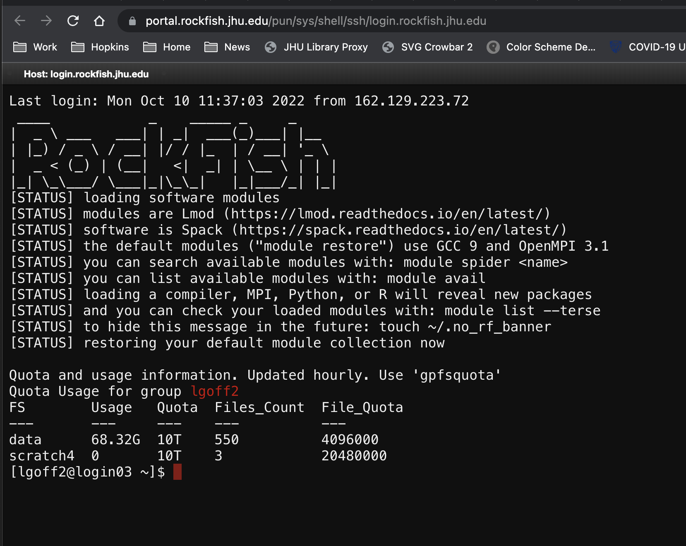

# Terminal access to rockfish cluster

1. Open a browser and go to [https://portal.rockfish.jhu.edu/](https://portal.rockfish.jhu.edu/)
2. Enter login credentials for rockfish cluster.
     
3. If successful, you will be presented with a page of various apps through which you can connect to rockfish.
     
4. For Terminal access, click on the "Rockfish HPC Cluster Shell Access" App.
5.   
6. A new tab should open in your browser with a bash terminal on a login node on rockfish.
  
7. Be sure to navigate to, and work out of your course 'student' directory
   `cd /data/lgoff2/ME-440/students/<your_directory_name>`
