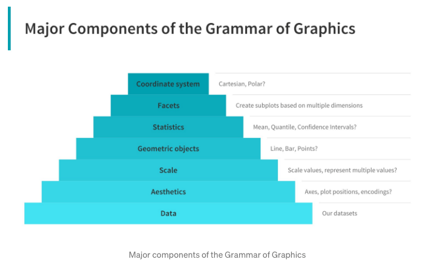
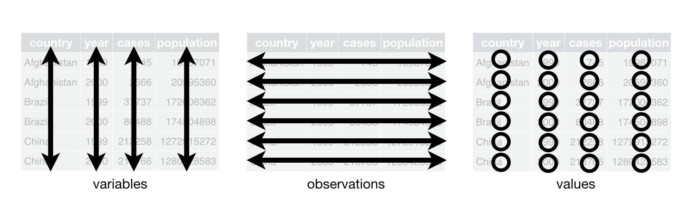

```{r setup, include=FALSE}
knitr::opts_chunk$set(echo = TRUE)
```

## Data Import

```{r}
# setwd("modules/module_9/notebooks")
library(SummarizedExperiment)
library(tidyverse)
GEO <- "GSE63482"

# Read in the data
data <- read.csv("https://github.com/gofflab/Quant_mol_neuro_2022/raw/main/modules/module_9/notebooks/GSE63482_Expression_matrix.tsv", sep = " ", header = T, row.names = 1)
```

```{r}
# Parse header into parameters
sample_metadata <- as.data.frame(stringr::str_split_fixed(colnames(data), "_", 2))
colnames(sample_metadata) <- c("Age", "CellType")
sample_metadata$SampleID <- colnames(data)
colData <- DataFrame(sample_metadata)

# Create Gene metadata
gene_metadata <- data.frame(geneName = rownames(data))
rownames(gene_metadata) <- rownames(data)
gene_metadata <- DataFrame(gene_metadata)

# Create a Summarized Experiment object
se <- SummarizedExperiment(
  assays = SimpleList(fpkm = as.matrix(data)),
  rowData = gene_metadata,
  colData = sample_metadata
)
```

# Indexing and manipulating data.frame objects

## Retrieving parts of a SummarizedExperiment

Retrieve expression matrix

```{r}
assayNames(se)
head(assay(se))
```

Retrieve gene metadata This data frame has only one column in there.

```{r}
head(rowData(se)) # Dataframe with gene metadata

# Vector of gene Names
rowData(se)$geneName
```

Retrieve sample metadata Two columns - age and cell type.

```{r}
head(colData(se))

# Retrieve the 'age' column
colData(se)$Age

colData(se)$CellType
```

```{r}
# Given a sample and a gene, retrieve the expression value
gene <- c("Sox2", "p53")
sample <- "E15_cpn"
assay(se, "fpkm")[gene, sample]
```

```{r}
rowData(se)$is.Homeobox <- grepl("^Hox", rowData(se)$geneName)
assay(se, "fpkm")[rowData(se)$is.Homeobox, ]
```

# PCA

```{r}
se.expressed <- se[rowSums(assay(se, "fpkm")) > 0, ]
se.pca <- prcomp(t(assay(se.expressed, "fpkm")), scale = TRUE, center = TRUE)

summary(se.pca)

screeplot(se.pca)

str(se.pca)

head(se.pca$x)


se.pca$x %>%
  as.data.frame() %>%
  ggplot(aes(x = PC1, y = PC2)) +
  geom_point(size = 2) +
  theme_bw(base_size = 12) +
  theme(legend.position = "top")
```

# Grammar of Graphics (ggplot2)

-   A layer-based framework to describe and construct visualizations in a structured manner.

-   Original grammar of graphics framework proposed by Leland Wilkinson

-   Modern layered grammar of graphics framework was developed by Hadley Wickham (author of ggplot2 package)

    

    When designing a visualization, consider these components in hierarchical order:

    1.  **Data**: Exactly *what* data do you plan on representing in your visualization? How does this need to be prepared in order to display your concept?

    2.  **Aesthetics**: What axes are needed for the data dimensions, or positions of various data points in the plot? Also check if any form of encoding is needed including size, shape, color and so on which are useful for plotting multiple data dimensions. These 'aesthetics' will define how your multi-dimensional data will be represented.

    3.  **Scale:** Do we need to scale the potential values, use a specific scale to represent multiple values or a range?

    4.  **Geometric objects:** What \'geometries\' or data visualization types are needed (e.g. points, bars, lines, tiles, etc)? How will you depict the data on the visualization.

    5.  **Statistics:** Do we need to show some statistical measures in the visualization like measures of central tendency, spread, confidence intervals? Will different dimensions of your data be summarized in a specific way?

    6.  **Facets:** Do we need to create subplots based on specific data dimensions (e,g, making the same plot but for different subsets of the data)?

    7.  **Coordinate system:** What kind of a coordinate system should the visualization be based on --- should it be cartesian or polar?

-   [ggplot2 Cheat Sheet](https://www.maths.usyd.edu.au/u/UG/SM/STAT3022/r/current/Misc/data-visualization-2.1.pdf)

## Plotting with ggplot2

### Start with organizing and planning your data

ggplot2 works by binding a dataset to a ggplot object. For the most effective use of ggplot, data are expected to be in a data.frame-style organization:



If we are interested in plotting the expression information for our se object, we might start with looking at the `assay` data:

```{r}
head(assay(se,'fpkm'))
```

With this layout we can plot samples (variables) against each other like so.

```{r}
plotData<-as.data.frame(assay(se,'fpkm'))

p <- ggplot(plotData)

p<- p + geom_point(aes(x=E15_cpn,y=E16_cpn))

p
```

we can layer-on additional visualizations that might help our interpretation of the data

```{r}
p <- p + geom_smooth(aes(x=E15_cpn,y=E16_cpn))
p
```

We can also change the scale of the axes as needed

```{r}
p + scale_y_log10() + scale_x_log10()
```

### Melting a SE object

To add sample information to this plot, we'll need to reorganize the data to make it compatible with ggplot's input expectations, Lets grab the information for a single gene and organize it for plotting with ggplot2. First let's grab the gene expression information from assay(se,'fpkm')


```{r}
gene <- "Fezf2"

geneData <- assay(se, "fpkm")[gene, ]

geneData
```

In order to transform these data from a wide-form format into a long-form format, we need to 'melt' geneData.


```{r}
geneData.melt <- reshape2::melt(geneData)
geneData.melt
```

Furthermore, to add all of the other useful information for each sample, we need to retrieve it from colData(se). We need to `merge` the melted data with the column data using a matching key (rownames of the melted expression values and colData!)

```{r}
geneData.melt <- merge(geneData.melt, colData(se), by.x = 0, by.y = 0)
geneData.melt <- as.data.frame(geneData.melt)
geneData.melt
```

We can now use this melted & merged data to make a ggplot plot.

```{r}
p <- ggplot(geneData.melt, aes(x = SampleID, y = value))

p + geom_point()
```

### Group by Age

```{r}

```

### Color by CellType

```{r}

```

### Plot as lines by CellType across Age

```{r}
p <- ggplot(geneData.melt, aes(x = Age, y = value))
p +
  geom_line(aes(color = CellType, group = CellType)) +
  geom_point()

# aes(size=value,shape=Age)?
```

## Functionalizing this process

Let's make a new function that takes as arguments a SummarizedExperiment object and a gene name, and melts and merges the data as above so that we can quickly make a data structure to help with plotting for any single gene

```{r}

meltSE <- function(se, geneName = "Sox2") {
  ???
  ???
  return(se.melted)
}
```

Use your new function to get the melted gene information for three different
genes, "Satb2", "Bcl11b", "Tle4" and quickly make line plots by CellType across
the sample Ages (Age vs. Expression grouped by CellType)

```{r}

```

## Multiple genes

Let's see what happens when we try and get the gene information for a handful of
genes using our meltSE function

```{r}
geneset <- c("Satb2", "Cux2", "Cux1", "Lhx2")
genesetData <- meltSE(se, geneName = geneset)


# meltSE version for multiple genes
meltSE <- function(se, genes) {

}

geneset.melt <- meltSE(se, geneset)
```

## Summary plots

```{r}
p <- ggplot(geneset.melt)

p + geom_boxplot(aes(x = Age, y = value, fill = Age))

p + geom_boxplot(aes(x = CellType, y = value, fill = CellType))
p + geom_violin(aes(x = CellType, y = value, fill = CellType))

p + geom_smooth(aes(x = Age, y = value, group = CellType, color = CellType, fill = CellType))
```

## Faceting

```{r}
p + geom_line(aes(x = Age, y = value, color = CellType, group = CellType)) +
  facet_wrap("gene")

p + geom_line(aes(x = Age, y = value, color = CellType, group = CellType)) +
  facet_wrap("gene", scales = "free_y")

p + geom_line(aes(x = Age, y = value, color = CellType, group = CellType)) +
  facet_grid(gene ~ CellType, scales = "free_y")
```

## Heatmaps

Heatmaps are a staple of gene expression analysis and are an information dense
way of exploring or summarizing the results of many types of tests or gene set
selections. While you _can_ generate a heatmap using ggplot2 (hint:
geom_tile()), there are also several specialized tools for generating heatmaps
that can be used instead. Here we will be using the R package
'[ComplexHeatmap](https://jokergoo.github.io/ComplexHeatmap-reference/book/index.html)'
to generate and manipulate heatmaps of a subset of the genes in our SE object.
The complete manual for ComplexHeatmap can be found
[here](https://jokergoo.github.io/ComplexHeatmap-reference/book/index.html).

```{r}
geneset <- c(
  "Ermn", "Cntn6", "Bhlhe22", "Oma1", "Gng7", "Cd55", "S100a10", "Pcp4",
  "Sox5", "Fezf2", "Npr3", "Bcl11b", "Foxp2", "Tbr1", "Ppp1r1b", "Tle4",
  "Ctgf", "Cplx3", "Inhba", "Hspb3", "Epha3", "Plxnd1", "Lhx2", "Cux2",
  "Ptn", "Satb2", "Cux1", "Pvrl3", "Tle3", "Tmtc4", "Shisa6", "Lmo4",
  "Limch1", "Cpne4", "Pou3f3", "Pou3f2", "Pou3f1"
)
```

Again, let's make a subset of the SE assay data for only the genes in this list
(we can do this because the rownames of the se object are the gene names)

```{r}
se.subset <- se[geneset, ]

se.subset
```

A quick heatmap can be made directly from the assay data itself

```{r}
if (!requireNamespace("ComplexHeatmap", quietly = TRUE)) {
  install.packages("ComplexHeatmap")
}

# Alternatively
# library(devtools)
# install_github("jokergoo/ComplexHeatmap")

library(ComplexHeatmap)

heatData <- assay(se.subset, "logfpkm")
Heatmap(heatData)
```

Let's add some annotation to the top of the heatmap to help us visually identify
different sample parameterizations. Heatmap annotations are important components
of a heatmap that it shows additional information that associates with rows or
columns in the heatmap. ComplexHeatmap package provides very flexible supports
for setting annotations and defining new annotation graphics. The annotations
can be put on the four sides of the heatmap, by top_annotation,
bottom_annotation, left_annotation and right_annotation arguments.

The value for the four arguments should be in the HeatmapAnnotation class and
should be constructed by HeatmapAnnotation() function

```{r}
sampleAnnot <- HeatmapAnnotation(
  Age = colData(se.subset)$Age,
  CellType = colData(se.subset)$CellType,
  gp = gpar(col = "black") # Adds a black line around each element to visually separate
)

Heatmap(heatData, top_annotation = sampleAnnot)
```

What do the dendrograms represent? What do they tell us about the relationship 
between genes? between samples? Can we improve the sample clustering? 
Lets try a version where we scale the genes (row z-score) so that 
higher-expressing genes don't dominate the clustering.

```{r}
heatData.scaled <- t(scale(t(heatData)))
Heatmap(heatData.scaled, top_annotation = sampleAnnot)
```

```{r}
Heatmap(heatData.scaled, top_annotation = sampleAnnot, column_split = 3, row_split = 3)
```

# Session Information

```{r session}
sessionInfo()
```
