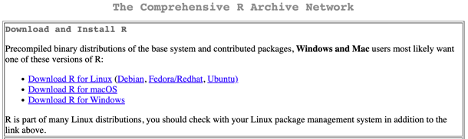

```{r inports}
```

```{r setup, include=FALSE}
knitr::opts_chunk$set(echo = TRUE)
```

# Connecting to the online high-performance compute environment
Throughout the course, students and instructors will have access to the rockfish high-performance compute environment at JHU. This is primarily our safeguard to streamline learning in case of troubleshooting issues on local installations (which are preferred). Prior to the first day of the course, all students should [https://coldfront.rockfish.jhu.edu/user/register/](register for accounts on the rockfish platform). Once you have created an account, we will add you to the reserved allocation for this semester's course.

## Introduction videos to rockfish

[Introduction videos](https://www.arch.jhu.edu/support/training-education/videos/)

# Local Installation
For much of the course, we hope that you will be able to follow along and perform your analyses on your local computer or an environment of your choosing. To do so, you will need to setup your compute environment by installing a few key software tools and programs. 

## Downloading & Installing R

To get started, you will first have to install R on your local machine. Both R and RStudio are free to download and use. R is developed and maintained by a large network of individuals and the software is made available (open source) on the [Comprehensive R Archive Network](http://cran.r-project.org/).



This video tutorial will walk you through the process of installing R on your machine.

[Installing R](https://vimeo.com/203516510)

## Downloading & Installing RStudio

RStudio is an 'Integrated Development Environment' (IDE) which is a program that is optimized for working and writing in a specific programming language(s). RStudio is *free* software that we will use to help learn R, and facilitate the development of our research projects during this course.

This video tutorial will help guide you in installing RStudio 

[Installing RStudio](https://vimeo.com/203516968)

### Windows 10 users
RStudio is originally designed to work with linux distributions and Mac OSX. Windows users are advised to additionally install a virtualization system called Windows Subsystem for Linux 2.0 (WSL2). This will create a 'virtual' linux computer within your Windows machine that will allow you to perform many of the linux/Mac-specific tasks required for this course and many types of data analysis. 

To install and configure your Windows10 system to use WSL2, please follow the instructions provided here:

[WSL2 Install and RStudio Setup for Windows](https://support.rstudio.com/hc/en-us/articles/360049776974-Using-RStudio-Server-in-Windows-WSL2)

# Taking R/RStudio for a test run
Once you've successfully installed R & RStudio, open the RStudio application and let's make sure that the environment is working for you. 

The video tutorial below provides a brief introduction to the RStudio interface outlining what each of the window panes (panels) contain:

[Introduction to RStudio Interface](https://www.youtube.com/watch?v=FIrsOBy5k58)

When you open RStudio, you are presented with a series of window panes and several tabs in each. In the top left is the 'script' pane in which open Rscripts, RMarkdown documents, RNotebooks, and other files can be viewed and edited.  This will be the primary panel where you will write your analysis code.

The bottom left panel houses the R console, and the command-line terminal console. This is where you will see the output of your code and where you can interactively try lines of code during your analysis before integrating them in your document.  For example.  In the R console type the following lines of code:

```{r eval=FALSE}
x<-c(4,12,5,3,8)
mean(x)
```

Let's breakdown what's happening in the first line of code. The function `c()` is a key function in R that stands for 'concatenate'.  Any comma-separated arguments (in this case a series of 5 integers) that are passed to `c()` are concatenated together into a 'list' datastructure.  That list is then 'assigned' to a variable using the `<-` operator (think of it as an arrow pointing to where you want to store the list). In R, you can use either the `<-` operator or the `=` operator to make assignments. In the case of this line, the list on the right side is assigned to the variable `x` on the left side. To execute this line, simply press return.

You should see that the first line, upon execution, doesn't do anything visible, but rather takes this list of integers and 'places' the list in the variable `x`. The second line calls the base R function `mean()` to take the mean of a all values that are stored in `x`. You should then get the answer `[1] 6.4`. Here the output value `6.4` is preceded by an integer in brackets called an index.  In this case, since there is only one value returned, the index of the results is `[1]`. 

If you can successfully perform the above operation, then your R/RStudio installation is up and running.

To round out the introduction to the remaining RStudio panes, the top right pane holds several tabs describing the current R environment (ie a list of variables and data that have been loaded into the current session), as well as a 'History' tab that keeps track of all of the commands that have been entered in this session.

The bottom right pane contains a useful file browser ('Files') and plot browser ('Plots') as well as a list of available and loaded packages and a 'Help' tab where you can search for information about how to use particular functions.

Prior to the beginning of the course, please try and familarize yourself with the RStudio interface by exploring each of these panes and tabs. 

# Installing your first package
R is a 'complete' language, in that with base R, you have all the tools that you would need to perform most data analysis tasks.  However, rarely do we want to start from scratch each time and write code to perform tasks or functions that others may have already written. Indeed, R, and Bioconductor as you will learn in this course, enjoy a rich ecosystem of code and functions that have already been written, developed, and maintained for many common data analysis tasks, statistical functions, and other useful tools. It's important to recognize that in most cases, code for the specific tasks you need for a project might have already been written, and we would like to leverage this code for our own use. This is the role of 'packages' in R. 

Packages are libraries of external code and/or data modules that you can 'import' into your work environment to add additional features or perform specific tasks. Before they can be used, however, they must be installed on your system.  There are several ways to do this depending on where the package you are interested in is located, but for many important packages, installation will require you to download the package from the CRAN archive.

## How to install R packages
The following video tutorial describes the process of installing packages using the primary `install.packages()` command that comes with R.

[Installing Packages in R](https://vimeo.com/203516241)

## Installing the 'tidyverse' package

```{r tidy_install, eval=FALSE}
install.packages('tidyverse')
```

# Session Information
```{r class.source = "fold-hide"}
sessionInfo()
```
